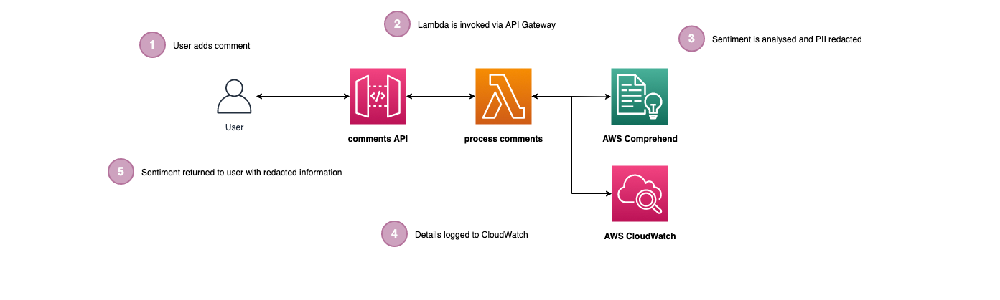

# serverless-comprehend

## Introduction

Examples of using AWS Comprehend for sentiment analysis and PII redaction for serverless applications, based on the following [blog post](https://leejamesgilmore.medium.com/are-your-serverless-customers-happy-or-sad-32f904ede5ff)

## What are we building?

The following diagram below shows what we are building in this repo:

The architecture is described below:

1. The user hits the `/comments` POST endpoint and adds a comment.
2. API Gateway invokes the lambda.
3. AWS Comprehend is used to understand the `sentiment` of the comment as well as redacting any `PII` from it.
4. The redacted comment and the sentiment is logged to AWS CloudWatch.
5. The redacted comment and sentiment are returned to the user in the response, along with the original comment.

## Deploying

🛑 **Note**: Running the following commands will incur charges on your AWS account so change the config accordingly.

In the base of the repo run `npm i` and then `npm run deploy:develop` (_this will install the dependencies and then deploy the solution_)

## Tearing down

In the base of the repo run `npm run remove:develop` (_this will remove the solution from AWS_)

## Testing

Use the Postman file in the `./postman/` folder to test the endpoints, logging into the CloudWatch console to view the output from the lambda to see how this is all working correctly.

This is covered in more detail in the associated blog post.

**\***\* The information provided are my own personal views and I accept no responsibility on the use of the information. \*\*\*\*\*\*
